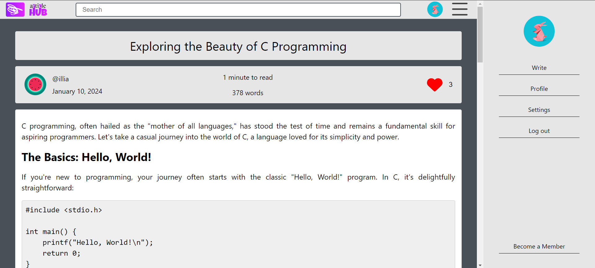

# Publishing Platform

## Introduction

The platform allows its users to create, manage and distribute written content. It incorporates features such as user profiles, article posting, the ability to follow/unfollow other users, and a feed of the most popular articles within the platform.

## TO DO

- Rewrite frontend using NextJS
- Rewrite backend using microservice architecture
- Deploy the project on Cloud (AWS)

## Screenshots

### Login Page


### Main Page


### Sign-up Page


### Article Page



## Running

```bash
docker compose up
```

The website is at <http://localhost:5173/>.

## Functional Requirements

The functionality of the publishing platform is divided into 3 user-defined groups.

- Anonymous User
- Authenticated User
- Administrator

Each of them has a different set of permissions and actions allowed.
Here are all the functional requirements described for each group.

- Anonymous User can
  - Log in
  - Create an account
  - Read articles
  - View user profiles
  - View following/followers of users

- Authenticated User can:
  - Log out from the account
  - Create an article
  - Delete an article that is published by the user
  - Like articles
  - Follow/unfollow other users
  - Become a subscribed user

- Administrator can:
  - Log out from the account
  - Ban a user
  - Unban a user
  - See a list of all users
